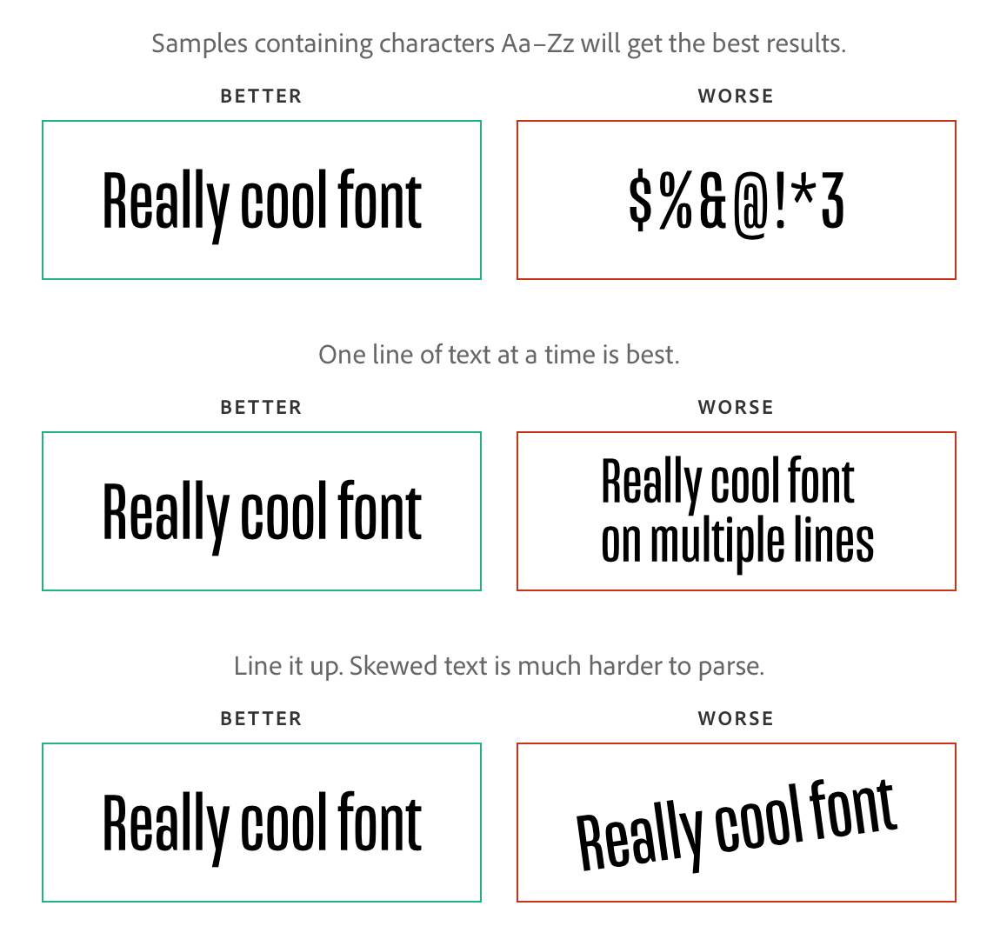

#Visual search input quality

Images don’t always produce good visual search results.

Good visual search results depend on good input. The algorithms Typekit uses to recognize letterforms in images perform better when the image is of good quality, the type area is clearly defined, and type is in a single, straight line.

Therefore:

Offer tips for preparing images for visual search — or better, auto-correct and present the results for approval.

Remind people that in order to get good results, the text in an image should be:

large enough (at least 100px in height)
on a single line
horizontal (not skewed)
high in contrast
alphanumeric characters (punctuation and symbols fare worse, and only Roman letters are supported)
cropped so that text is the only part of the image being evaluated
You can instruct the Typekit API to crop images by passing coordinate values to the `visual_search` endpoint, but this is optional — your application may not require coordinates.

If the input image contains more than one line of text, use the `visual_search/regions` endpoint to gather coordinates for separate lines of text, prompt users to choose the region they want to use for search input, and feed that region’s coordinates to the `visual_search` endpoint.

Using OCR results from the Typekit API, ask people to confirm the text in the image. This improves input, and also makes visual search results more useful.
